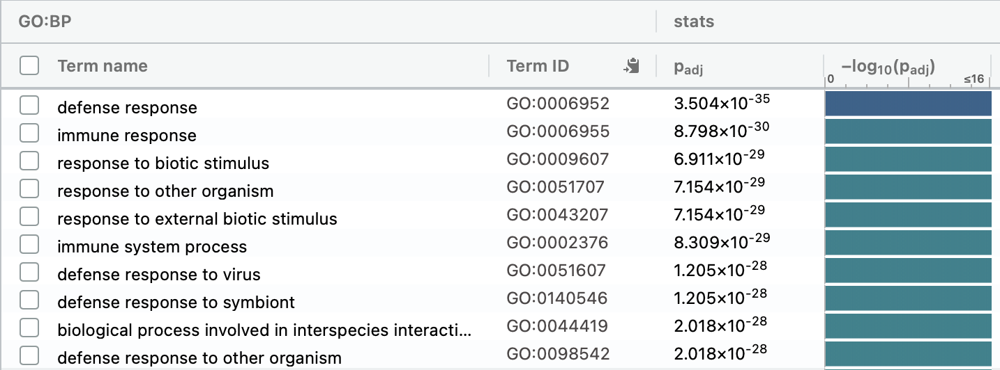
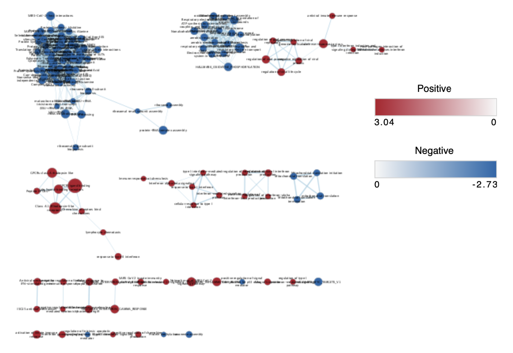

```{r setup, include=FALSE}
knitr::opts_chunk$set(echo = TRUE)
```

# Introduction
In late 2019, a novel coronavirus, severe acute respiratory syndrome coronavirus 2 (SARS-CoV-2), which cause a severe respiratory disease, emerged in Wuhan, China. The virus spread all over the world, and infected more than 750 million people [@WHO_COVID_Dashboard]. It is reported that patients in different population shows different trend of symptoms. For example, females are less likely to infect SARS-CoV-2 [@10.1371/journal.ppat.1005374]. However, mechanisms behind such a difference is still unknown. Lieberman et. al. examined gene expression in response to SARS-CoV-2 infection with shotgun RNA Sequencing to see the gene expression changes[@10.1371/journal.pbio.3000849]. Test condition is 430 SARS-CoV-2 patients and control condition is 54 non-infected individuals.\
In the first assignment, RNASeq data of the paper by Lieberman[@10.1371/journal.pbio.3000849] were obtained from GEO, and its ID is GSE152075. There are 35784 genes in this dataset, and 430 samples from SARS-CoV-2 patients i.e. testing samples and 54 samples from controls. The RNASeq data was mapped to HUGO gene symbols, cleaned e.g. duplicates and low counts were removed, normalized with TMM normalization. MDS plot indicates a good quality of the dataset as positive and negative samples are well-separated. In the second assignment, the normalized data is analyzed with differential gene expression analysis, and genes are ranked. Then thresholded over-representation analysis reveals the notably expressed gene. The result showed a trend up-regulation of anti-viral factors and down-regulation of genes related to ribosomes, which is mostly consistent with the Lieberman et.al. report.
In this assignment, non-thresholded pathway analysis is performed. The result is visualized with Cytoscape and the Enrichment map pipeline.

# Setup
```{R message=FALSE, warning=FALSE}
# Download Packages.
if (!requireNamespace("knitr", quietly = TRUE))
  BiocManager::install("knitr")
# Download data from the second assignment.
qlf_output <- read.table("qlf_output.txt")
knitr::kable(head(qlf_output), format = "html", digits = 64)
```

# Non-thresholded Gene set Enrichment Analysis
## Method and Genesets
Gene Set Enrichment Analysis, GSEA [@10.1038/ng1180] [@10.1073/pnas.0506580102], version 4.3.3 is used for non-thresholded pathway analysis. As a geneset, Human_GOBP_AllPathways_noPFOCR_no_GO_ies_March_01_2024.gmt was taken from Gary Bader lab, University of Toronto [@geneset]. Note that GSEA was run following a tutorial by Isserlin [@GSEATutorial].

## Result
A ranked list is generated based on the ranked genes set from the second assignment.
```{R message=FALSE, warning=FALSE}
# Make a ranked list.
ranked_qlf_output <- data.frame(rownames(qlf_output), - log10(qlf_output$PValue) * sign(qlf_output$logFC))
colnames(ranked_qlf_output) <- c("Genes", "Rank")
# Sort decsending for enrichment map.
ranked_qlf_output <- ranked_qlf_output[order(ranked_qlf_output$Rank, decreasing=TRUE),]
knitr::kable(head(ranked_qlf_output), format = "html")
# Save as .rnk file for GSEA.
write.table(ranked_qlf_output, file.path(getwd(), "ranked_qlf_output.rnk"), sep = "\t", row.names = FALSE, col.names = TRUE, quote = FALSE)
```
GSEA was performed with GUI. The ranked list and the geneset above are used. Regarding to options, the number of permutations is set to 100, there is no collapse to gene symbols as already done in the first assignment, max/min size is 200/10, and weighted is used for enrichment method.
7503 genes were used for the analysis, which is enough. There were 650 and 502 gene sets had FDR less than 25% for positive/negative phenotype respectively, and FDR threshold needs to be lower.
Snapshots showed the expected trend. Positive/negative phenotype top genesets are dominant with up/down-regulated genes respectively.


Figure 1: Snapshot of GSEA top 20 positive phenotype genesets.


Figure 2: Snapshot of GSEA top 20 negative phenotype genesets.

Tabular result shows the correlation between immune-related pathways and positive phenotype genesets. Note that many pathways are involved in interferon. On the other hand, pathways related to protein synthesis are dominant in the result for negative phenotype genesets.

Figure 3: GSEA top 10 results for positive phenotype genesets.


Figure 4: GSEA top 10 results for negative phenotype genesets.

## Comparison to the Thresholded Analysis
The results of thredholded/non-thresholded analysis are very similar. For positive patients, immune pathways, especially interferon, are often seen, and negative patients results tend to have translation-related pathways. It is interesting that Lieberman states there is a reduction in transcription of some interferon-related genes[@10.1371/journal.pbio.3000849] but both analysis showed the opposite trend. This is not clearly understood, but this is possibly because of gender or ethnicity. Chen et. al. report that transcription of ACE2, which is a interferon-responsive genes, significantly increase in Asian females, moderately decrease in elderly people in all ethnic groups, and highly significant decrease in type II diabetic patients[@10.1111/acel.13168]. There is no information about patients except for SARS-CoV-2 positive/negative in the original paper due to privacy reason. Therefore, it is impossible to analyse further here.


Figure 5: g:Profiler result of up-regulated genes from GO biological process. Top 10 results are shown here.


Figure 6: g:Profiler result of down-regulated genes from GO biological process. Top 10 results are shown here.

# Visualize Gene set Enrichment Analysis in Cytoscape
## Enrichment Map
An enrichment map was generated with EnrichmentMap app in Cytoscape. There are 133 nodes and 1485 edges. FDR q-value cutoff, p-value cutoff and edge cutoff were set to 0.001, 0.05 and 0.375 respectively.


Figure 7: Enrichment Map for GSEA result. Red nodes are for up-regulated genes and blue nodes are for down-regulated genes.

## Annotation of Network
An annotated network was generated with AutoAnnotate app in Cytoscape. Parameters are shown in figure 8. In addidion to those parameters, font scale is set to 33%.


Figure 8: Annotated Network for GSEA result.


Figure 9: Parameters for the Annotated Network.

# Interpretation
The result of this report mostly supports the original paper. It is stated that anti-viral factors are up-regulated and genes involved in translation are down-regulated [@10.1371/journal.pbio.3000849]. The figures above shows the trend of up-regulated immune system genes and down-regulated protein synthesis genes. This result is also consistent with the result of the second assignment.
Chen et. al. report that transcription of ACE2, which is a interferon-responsive genes, significantly increase in Asian females, moderately decrease in elderly people in all ethnic groups, and highly significant decrease in type II diabetic patients[@10.1111/acel.13168]. This supports our result, because there is a cluster of up-regulated interferon-related genes in the middle of figure 7.

# Reference