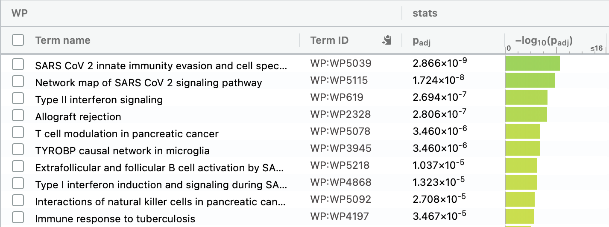

```{r setup, include=FALSE}
knitr::opts_chunk$set(echo = TRUE)
```

# Introduction
In late 2019, a novel coronavirus, severe acute respiratory synfrome coronavirus 2 (SARS-CoV-2), which cause a severe respiratory disease, emerged in Wuhan, China. The virus spread all over the world, and infected more than 750 million people [@WHO_COVID_Dashboard]. It is reported that patients in different population shows different trend of symptoms. For example, females are less likely to infect SARS-CoV-2 [@10.1371/journal.ppat.1005374]. However, mechanisms behind such a difference is still unknown. Lieberman et. al. examined gene expression in response to SARS-CoV-2 infection with shotgun RNA Sequencing to see the gene expression changes[@10.1371/journal.pbio.3000849]. Test condition is 430 SARS-CoV-2 patients and control condition is 54 non-infected individuals.\
In the first assignment, RNASeq data of the paper by Lieberman[@10.1371/journal.pbio.3000849] were obtained from GEO, and its ID is GSE152075. There are 35784 genes in this dataset, and 430 samples from SARS-CoV-2 patients i.e. testing samples and 54 samples from controls. The RNASeq data was mapped to HUGO gene symbols, cleaned e.g. duplicates and low counts were removed, normalized with TMM normalization. MDS plot indicates a good quality of the dataset as positive and negative samples are well-separated.
In this assignment, the normalized data is analyzed with differential gene expression analysis, and genes are ranked. Then thresholded over-representation analysis reveals the notably expressed gene.

# Setup
```{R message=FALSE, warning=FALSE}
if (!requireNamespace("knitr", quietly = TRUE))
  BiocManager::install("knitr")
if (!requireNamespace("edgeR", quietly = TRUE)) 
  BiocManager::install("edgeR")
if (!requireNamespace("scales", quietly = TRUE)) 
  BiocManager::install("scales")
if (!requireNamespace("circlize", quietly = TRUE))
  BiocManager::install("circlize")
if (!requireNamespace("ComplexHeatmap", quietly = TRUE))
  BiocManager::install("ComplexHeatmap")
if (!requireNamespace("grid", quietly = TRUE))
  BiocManager::install("grid")
```

# Differential Gene Expression
## Data Loading
The normalized count data and groups from the first assignment are loaded.
```{R message=FALSE, warning=FALSE}
# The normalized count data
normalized_count <- read.table("normalized_counts.txt")
# The beginning of the dataset.
knitr::kable(normalized_count[1:15,1:5], format = "html")
# The end of the test samples and the beginning of the controls.
knitr::kable(normalized_count[1:15, 428:432], format = "html")
# The end of the controls.
knitr::kable(normalized_count[1:15, 480:484], format = "html")

# The groups defined in the first assignment
samples <- read.table("samples.txt")
# The beginning of the dataset.
knitr::kable(samples[1:5, ], format = "html")
# The end of the test samples and the beginning of the controls.
knitr::kable(samples[428:432, ], format = "html")
# The end of the controls.
knitr::kable(samples[480:484, ], format = "html")
```

Note that some samples are omitted e.g.NEG_061, and further details about patients are not submitted by the author for a privacy reason.

## Calculate P-Values
```{R message=FALSE, warning=FALSE}
# Create DGEList object.
filtered_data_matrix <- as.matrix(normalized_count)
d <- edgeR::DGEList(counts=filtered_data_matrix, group=samples$cell_type)
# Create a design model.
model_design_pat <- model.matrix(~samples$SARS.CoV.2 + samples$individual)
# Estimate dispersion.
d <- edgeR::estimateDisp(d, model_design_pat)
# Calculate normalization factors.
d <- edgeR::calcNormFactors(d)
# MDS plot.
limma::plotMDS(d, 
               labels=rownames(samples), 
               col = c("darkgreen","blue")[factor(samples$SARS.CoV.2)],
               main = "MDS Plot")
```

Figure 1: A MDS plot of samples. Blue: SARS-CoV-2 positive patients, green: SARS-CoV-2 negative patients.

There is a clear separation between positive(blue) and negative(green) samples. This indicates that there is not big patient factor. Quasi likelihood test is applied here, because there are 484 samples, which is too much for likelihood ratio test.

```{R message=FALSE, warning=FALSE}
# Create DGEList object.
filtered_data_matrix <- as.matrix(normalized_count)
d <- edgeR::DGEList(counts=filtered_data_matrix, group=samples$cell_type)
# Estimate Dispersion.
d <- edgeR::estimateDisp(d, model_design_pat)
# Fit the model.
fit <- edgeR::glmQLFit(d, model_design_pat)
# Obtain differential expression with Quasi likelihood test.
qlf.pos_vs_neg <- edgeR::glmQLFTest(fit, coef="samples$SARS.CoV.2POS")
# Get the result.
qlf_output <- edgeR::topTags(qlf.pos_vs_neg, sort.by = "PValue", n = nrow(normalized_count))
knitr::kable(head(qlf_output), format = "html", digits = 64)
# Save as .txt file for future assignments.
write.table(qlf_output, file.path(getwd(), "qlf_output.txt"))
# The number of genes which pass the threshold (0.01).
length(which(qlf_output$table$PValue < 0.01))
```
There are `r length(which(qlf_output$table$PValue < 0.01))` genes showed significant differential expression. The threshold is 0.01 here, because the sample size is very large and the p-values tend to be higher.

## Multiple Hypothesis Testing
For multiple hypothesis testing, Bonferroni method is not proper in this case, because there is a huge number of genes in this dataset and Bonferroni method tends to be too strict with large hypothesis. Therefore, FDR is used here. Threshold is set 0.01 for the same reason as p-value above.
```{R message=FALSE, warning=FALSE}
# The number of genes which pass the threshold (0.01) with FDR.
length(which(qlf_output$table$FDR < 0.01))
```
`r length(which(qlf_output$table$FDR < 0.01))` genes passes the correction with FDR.
Correction with Bonferroni method is shown below.
```{R message=FALSE, warning=FALSE}
# The number of genes which pass the threshold (0.01) with Bonferroni method.
length(which(qlf_output$table$PValue < 0.01 / length(qlf_output$table$PValue)))
```
There are `r length(which(qlf_output$table$PValue < 0.01 / length(qlf_output$table$PValue)))` genes passed the correction with Bonferroni method and this is much smaller than the one with FDR. 
However, there are still too many genes with 0.01 threshold and this causes some errors. Therefore, 0.001 is used as threshold instead in later cases.
```{R message=FALSE, warning=FALSE}
# The number of genes which pass the threshold (0.001).
length(which(qlf_output$table$PValue < 0.001))
# The number of genes which pass the threshold (0.001) with FDR.
length(which(qlf_output$table$FDR < 0.001))
```
There are `r length(which(qlf_output$table$PValue < 0.001))` genes with p-value which pass 0.001 threshold, and `r length(which(qlf_output$table$FDR < 0.001))` genes which pass the correction.

## Volcano Plot
```{R message=FALSE, warning=FALSE}
# Apply grey for all at first.
color_volcano <- rep("grey", length(qlf_output$table$PValue))
# Red for up-regulated ones.
# Note 0.001, not 0.01 threshold is used here for the reason mentioned above.
color_volcano[qlf_output$table$logFC > 2 & qlf_output$table$FDR < 0.001] <- 'red'
# Blue for down-regulated ones.
# Note 0.001, not 0.01 threshold is used here for the reason mentioned above.
color_volcano[qlf_output$table$logFC < -2 & qlf_output$table$FDR < 0.001] <- 'blue'
# Volcano plot.
plot(qlf_output$table$logFC, 
     -log10(qlf_output$table$PValue), 
     col = scales::alpha(color_volcano, 0.3),
     pch = 16,
     xlab = "log2 fold change",
     ylab = "-log10 p",
     main = "Volcano Plot for SARS-CoV-2 Positive/Negative Patients"
)
legend("topright", 
       legend=c("Upregulated Genes","Downregulated Genes", "Not Significant Genes"), 
       fill = c("red", "blue", "grey"))
```

Figure 2: A volcano plot for SARS-CoV-2 positive/negative patients. Genes whose log2 fold change is more than 2 and FDR is less than the threshold is defined as up-regulated genes and colored in red. Down-regulated genes are those which has less than -2 logs fold change and less than the threshold FDR, and are shown in blue. Note that the threshold is set 0.001, not 0.01.

## Heatmap
```{R message=FALSE, warning=FALSE}
# Create a numerical matrix of genes with FDR less than the threshold.
# Note 0.001, not 0.01 threshold is used here for the reason mentioned above.
# Here is the error given when 0.01 threshold is used. This is probably because of too many genes and patients.
# Error in getFromNamespace(device_info[3], ns = device_info[2])(temp_image) : 
#  unable to open /var/folders/cc/myvsc01x5gs6_76g6xsmrb6m0000gn/T//RtmpXOogRM/.heatmap_body_e4228f848277c0ae2290f1a79e9515a1_1_144e32682e9a3.png
tophits <- normalized_count[rownames(normalized_count) %in% 
                                     rownames(qlf_output$table[which(qlf_output$table$FDR < 0.001),]),]
heatmap_matrix <- t(scale(t(tophits)))
# Set a color table.
if(min(heatmap_matrix) == 0){
  heatmap_col <- circlize::colorRamp2(c(0, max(heatmap_matrix)), c( "white", "red"))
}else{
  heatmap_col <- circlize::colorRamp2(c(min(heatmap_matrix), 0, max(heatmap_matrix)), c("blue", "white", "red"))
}
# Build a heatmap.
heatmap_tophits <- ComplexHeatmap::Heatmap(as.matrix(heatmap_matrix),
                                   cluster_rows = TRUE,
                                   cluster_columns = TRUE,
                                   show_row_dend = TRUE,
                                   show_column_dend = TRUE,
                                   col = heatmap_col,
                                   show_column_names = TRUE,
                                   show_row_names = FALSE,
                                   show_heatmap_legend = TRUE,
                                   column_names_gp = grid::gpar(fontsize = 2)
                                   )
ComplexHeatmap::draw(heatmap_tophits, column_title = "Heatmap for SARS-CoV-2 Positive/Negative Patients")
```

Figure 3. Heatmap for genes with significant differential expression. SARS-CoV-2 negative patients are clustered on the left, although the font size of column names are so small that they can be hardly read. Note that the threshold is set 0.001, not 0.01.

In the bottom, there is a cluster of up-regulated genes in SARS-CoV-2 negative patients and such genes are downregulated in SARS-CoV-2 positive patients. Genes at the top tend to be more down-regulated in SARS-CoV-2 negative patients, but genes in SARS-CoV-2 positive patients are not up-regulated. This is probably because most patients are SARS-CoV-2 positive (430 out of 484) and genes that are up-regulated specifically in positive patients cannot give small enough FDR.

# Thresholded Over-Representation Analysis
## Method
Thresholded over-representation analysis is performed with g:Profiler. This is because g:Profiler was used in the lecture and is very handy for this assignment, especially with the web interface.

## Annotation Data
GO biological process, Reactome, and WikiPathways are used here. This is because these datasets are for human. They were released in 2024-01-17, 2024-01-25, 2024-01-01 respectively.

## Genesets
Up-/down-regulated genes are defined with the threshold of 0.001.
```{R message=FALSE, warning=FALSE}
# Extract up-regulated genes.
# Note that the threshold is set 0.001, not 0.01.
up_genes <- rownames(qlf_output)[qlf_output$table$logFC > 0 & qlf_output$table$PValue < 0.001]
length(up_genes)
# Write into text files.
write.table(up_genes, 
           "upregulated_genes.txt",
           sep = "\t",
           row.names = FALSE,
           col.names = FALSE,
           quote = FALSE
           )
# Extract up-regulated genes.
# Note that the threshold is set 0.001, not 0.01.
down_genes <- rownames(qlf_output)[qlf_output$table$logFC < 0 & qlf_output$table$PValue < 0.001]
length(down_genes)
# Write into text files.
write.table(down_genes, 
           "downregulated_genes.txt",
           sep = "\t",
           row.names = FALSE,
           col.names = FALSE,
           quote = FALSE
           )
# Extract genes for whole list.
# Note that the threshold is set 0.001, not 0.01.
whole_genes <- rownames(qlf_output)[qlf_output$table$PValue < 0.001]
# Write into text files.
write.table(whole_genes, 
           "whole_genes.txt",
           sep = "\t",
           row.names = FALSE,
           col.names = FALSE,
           quote = FALSE
           )
```
There are `r length(up_genes)` up-regulated genes and `rlength(down_genes)` down-regulated genes.

## Run the thresholded over-representation analysis
The thresholded over-representation analysis is performed with the web interface (https://biit.cs.ut.ee/gprofiler/gost). BH FDR is used for significance threshold and the threshold is 0.001.


Figure 4: g:Profiler result of up-regulated genes from GO biological process. Top 10 results are shown here.


Figure 5: g:Profiler result of up-regulated genes from Reactome. Top 10 results are shown here. Pathways shown in grey indicates that they are above the threshold.



Figure 6: g:Profiler result of up-regulated genes from WikiPathways. Top 10 results are shown here.

Almost all the pathways for up-regulated genes are related to immune system. Note that among such immune systems, pathways involved in a response to viruses are dominant. This looks reasonable as a up-regulated genes for SARS-CoV-2 positive patients.


Figure 7: g:Profiler result of down-regulated genes from GO biological process. Top 10 results are shown here.


Figure 8: g:Profiler result of down-regulated genes from Reactome. Top 10 results are shown here.


Figure 9: g:Profiler result of down-regulated genes from WikiPathways. Top 10 results are shown here. Pathways shown in grey indicates that they are above the threshold.

For down-regulated genes, there are many pathways for translation. I found it interesting that there are pathways for respiration system, although the reason is unclear. 


Figure 10: g:Profiler result of whole list from GO biological process. Top 10 results are shown here.


Figure 11: g:Profiler result of whole list from Reactome. Top 10 results are shown here.


Figure 12: g:Profiler result of whole list from WikiPathways. Top 10 results are shown here. Pathways shown in grey indicates that they are above the threshold.

For the whole list, these are apparently a combination of up-/down-regulated reason and not difference found.

# Interpretation
## Comparison to the Original Paper
The result mostly supports the original paper. Lieberman et.al. reported that up-regulation of anti-viral factors and down-regulation of genes related to ribosomes. However, they also state that reduction in transcription of some interferon-related genes. There is no pathways about interferon in g:Profiler result for down-regulated genes, but there is in the result for up-regulated genes. This might be because of different annotation sources form the original paper. In addition, g:Profiler result does not directly contradict to the original paper because increased expression of interferon response genes are also reported in the original paper.[@10.1371/journal.pbio.3000849]

## Publications to Support the Result
Chen et. al. report that transcription of ACE2, which is a interferon-responsive genes, significantly increase in Asian females, moderately decrease in elderly people in all ethnic groups, and highly significant decrease in type II diabetic patients[@10.1111/acel.13168]. Therefore, patients variation like ethnicity, sex or health condition may have a huge impact on the interferon related gene transcription but the impact is not evident in this report because details about patients are not released in Lieberman et.al. paper for privacy reason. [@10.1371/journal.pbio.3000849].

# Reference